# 🚀 Smart Resume Builder AI

## 🎯 Overview

**Smart Resume Builder AI** is a comprehensive, AI-powered resume building platform that helps job seekers create professional resumes, optimize them for ATS systems, generate personalized cover letters, and practice with AI-generated interview questions. Built with modern web technologies and powered by OpenAI's GPT models.

## 📊 Application Flow

```mermaid
graph TD
    A[🏠 Landing Page] --> B{User Authenticated?}
    B -->|No| C[🔐 Login/Register]
    B -->|Yes| D[📋 Dashboard]
    C --> D
    
    D --> E[📝 Resume Builder]
    D --> F[👁️ Resume Preview]
    D --> G[🔍 ATS Check]
    D --> H[📊 AI Review]
    D --> I[🎤 Interview Questions]
    D --> J[💼 Cover Letter]
    
    E --> E1[👤 Personal Info]
    E --> E2[🎯 Career Objective]
    E --> E3[💼 Work Experience]
    E --> E4[🎓 Education]
    E --> E5[⚡ Skills]
    E --> E6[🛠️ Projects]
    E --> E7[🏆 Certifications]
    
    E1 --> K[🗣️ Voice Editor]
    E2 --> K
    E3 --> K
    E4 --> K
    E5 --> K
    E6 --> K
    E7 --> K
    
    K --> L[💾 Save Resume]
    L --> F
    
    F --> M[🎨 Template Selection]
    M --> M1[📄 Classic Template]
    M --> M2[✨ Modern Template]
    M --> M3[🌟 Elegant Template]
    
    F --> N[📥 PDF Export]
    F --> O[🔗 Share Resume]
    
    G --> G1[📈 ATS Score Analysis]
    G1 --> G2[🔧 Optimization Suggestions]
    G2 --> G3[📝 Keyword Recommendations]
    
    H --> H1[🤖 AI Content Analysis]
    H1 --> H2[💡 Improvement Suggestions]
    H2 --> H3[📋 Professional Feedback]
    
    I --> I1[🎯 Job Title Input]
    I1 --> I2[🤖 AI Question Generation]
    I2 --> I3[📋 Personalized Questions]
    I3 --> I4[🎙️ Practice Mode]
    
    J --> J1[💼 Job Description Input]
    J1 --> J2[🤖 AI Cover Letter Generation]
    J2 --> J3[📄 Customized Cover Letter]
    
    style A fill:#e1f5fe
    style D fill:#f3e5f5
    style E fill:#e8f5e8
    style F fill:#fff3e0
    style G fill:#fce4ec
    style H fill:#e0f2f1
    style I fill:#f1f8e9
    style J fill:#e3f2fd
```



## 🏗️ System Architecture

```mermaid
graph TB
    subgraph "Frontend (Client)"
        UI[🎨 User Interface]
        AUTH[🔐 Authentication]
        VOICE[🎙️ Voice Editor]
        PREVIEW[👁️ Preview System]
    end
    
    subgraph "Backend (Server)"
        API[🌐 Express.js API]
        CTRL[🎛️ Controllers]
        ROUTES[🛣️ Routes]
        MIDDLEWARE[⚙️ Middleware]
    end
    
    subgraph "Database"
        MONGO[(🍃 MongoDB)]
        USER_MODEL[👤 User Model]
        RESUME_MODEL[📄 Resume Model]
    end
    
    subgraph "External Services"
        OPENAI[🤖 OpenAI API]
        SPEECH[🗣️ Speech Recognition API]
    end
    
    subgraph "AI Features"
        INTERVIEW[🎤 Interview Questions]
        REVIEW[📊 Resume Review]
        COVER[💼 Cover Letter]
        ATS[🔍 ATS Analysis]
    end
    
    UI --> API
    AUTH --> API
    VOICE --> SPEECH
    PREVIEW --> API
    
    API --> ROUTES
    ROUTES --> CTRL
    CTRL --> MIDDLEWARE
    
    CTRL --> MONGO
    MONGO --> USER_MODEL
    MONGO --> RESUME_MODEL
    
    CTRL --> OPENAI
    OPENAI --> INTERVIEW
    OPENAI --> REVIEW
    OPENAI --> COVER
    OPENAI --> ATS
    
    style UI fill:#e3f2fd
    style API fill:#f3e5f5
    style MONGO fill:#e8f5e8
    style OPENAI fill:#fff3e0
```



## 🔄 AI Processing Flow


## ✨ Key Features

### 🤖 AI-Powered Tools
- **AI Resume Review** - Get intelligent feedback on your resume content and structure
- **AI Interview Questions** - Generate personalized interview questions based on your resume and target role
- **AI Cover Letter Generator** - Create tailored cover letters for specific job applications
- **ATS Optimization** - Analyze and optimize your resume for Applicant Tracking Systems

### 🎨 Resume Builder
- **Multiple Templates** - Choose from Classic, Modern, and Elegant designs
- **Real-time Preview** - See changes instantly as you build your resume
- **Drag & Drop Interface** - Intuitive section management
- **Voice Editor** - Edit your resume using voice commands and speech-to-text

### 🔧 Advanced Features
- **PDF Export** - Download professional PDF versions
- **Public Resume Sharing** - Share your resume with clean, shareable URLs
- **User Authentication** - Secure login and data management
- **Responsive Design** - Works seamlessly on desktop and mobile devices

## 🛠️ Technology Stack

### Frontend
- **HTML5/CSS3** - Modern web standards
- **JavaScript (ES6+)** - Dynamic functionality
- **Bootstrap 5** - Responsive UI framework
- **Font Awesome** - Professional icons

### Backend
- **Node.js** - Server runtime
- **Express.js** - Web application framework
- **MongoDB** - Database for user data and resumes
- **Mongoose** - MongoDB object modeling

### AI Integration
- **OpenAI API** - GPT models for content generation
- **Speech Recognition API** - Voice editing capabilities

### Security & Authentication
- **JWT** - JSON Web Tokens for authentication
- **bcryptjs** - Password hashing
- **CORS** - Cross-origin resource sharing

## 🚀 Quick Start

### Prerequisites
- Node.js (v14 or higher)
- MongoDB (local or cloud instance)
- OpenAI API key

### Installation

1. **Clone the repository**
   ```bash
   git clone https://github.com/your-username/smart-resume-builder-ai.git
   cd smart-resume-builder-ai
   ```

2. **Install dependencies**
   ```bash
   npm install
   ```

3. **Environment Setup**
   Create a `.env` file in the root directory:
   ```env
   MONGODB_URI=mongodb://localhost:27017/smart-resume-builder
   PORT=5000
   JWT_SECRET=your-super-secret-jwt-key
   OPENAI_API_KEY=your-openai-api-key
   ```

4. **Start the application**
   ```bash
   # Development mode
   npm run dev
   
   # Production mode
   npm start
   ```

5. **Access the application**
   Open your browser and navigate to `http://localhost:5000`

## 📁 Project Structure

```
smart-resume-builder-ai/
├── client/                 # Frontend files
│   ├── index.html         # Landing page
│   ├── login.html         # User authentication
│   ├── register.html      # User registration
│   ├── home.html          # Dashboard
│   ├── resume-builder.html # Resume builder interface
│   ├── preview.html       # Resume preview and export
│   ├── ats-check.html     # ATS optimization tool
│   ├── review.html        # AI resume review
│   ├── interview-questions.html # AI interview prep
│   ├── style.css          # Main stylesheet
│   ├── script.js          # Main JavaScript
│   ├── auth.js            # Authentication logic
│   ├── preview.js         # Preview functionality
│   ├── ats.js             # ATS checking logic
│   ├── review.js          # Review system
│   ├── voiceEditor.js     # Voice editing features
│   └── dragdrop.js        # Drag and drop functionality
├── server/                # Backend files
│   ├── index.js           # Main server file
│   ├── controllers/       # Business logic
│   │   ├── authController.js
│   │   ├── resumeController.js
│   │   ├── aiController.js
│   │   ├── atsController.js
│   │   ├── reviewController.js
│   │   └── interviewController.js
│   ├── models/            # Database models
│   │   ├── User.js
│   │   └── Resume.js
│   └── routes/            # API routes
│       ├── auth.js
│       ├── resume.js
│       ├── ai.js
│       ├── ats.js
│       ├── review.js
│       └── interview.js
├── .env                   # Environment variables
├── .gitignore            # Git ignore rules
├── package.json          # Dependencies and scripts
└── README.md             # This file
```

## 🎯 Usage Guide

### Creating Your First Resume

1. **Sign Up/Login** - Create an account or log in to an existing one
2. **Build Resume** - Use the resume builder to add your information:
   - Personal Information
   - Career Objective
   - Work Experience
   - Education
   - Skills
   - Projects
   - Certifications
3. **Choose Template** - Select from available design templates
4. **Preview & Export** - Review your resume and download as PDF

### AI Features

#### AI Resume Review
- Navigate to the Review section
- Upload or use your built resume
- Get AI-powered feedback on content, structure, and improvements

#### AI Interview Questions
- Go to the Interview Questions section
- Enter the job title you're applying for
- Generate personalized questions based on your resume
- Practice and prepare for your interviews

#### ATS Optimization
- Use the ATS Check tool
- Analyze your resume for ATS compatibility
- Get suggestions for improvement

### Voice Editor
- Enable microphone permissions
- Use voice commands to edit resume sections
- Speech-to-text functionality for hands-free editing

## 🔧 Configuration

### Environment Variables

| Variable | Description | Required |
|----------|-------------|----------|
| `MONGODB_URI` | MongoDB connection string | Yes |
| `PORT` | Server port (default: 5000) | No |
| `JWT_SECRET` | Secret key for JWT tokens | Yes |
| `OPENAI_API_KEY` | OpenAI API key for AI features | Yes |

### OpenAI API Setup

1. Sign up at [OpenAI](https://openai.com/)
2. Generate an API key
3. Add the key to your `.env` file
4. Ensure you have sufficient API credits

## 🚀 Deployment

### Production Deployment

1. **Environment Setup**
   ```bash
   NODE_ENV=production
   ```

2. **Database Setup**
   - Use MongoDB Atlas or a production MongoDB instance
   - Update `MONGODB_URI` in your environment

3. **Server Deployment**
   - Deploy to platforms like Heroku, Vercel, or AWS
   - Ensure environment variables are set
   - Use process managers like PM2 for Node.js

4. **Static Files**
   - Serve static files through a CDN if needed
   - Configure proper CORS settings

## 🤝 Contributing

We welcome contributions! Please follow these steps:

1. Fork the repository
2. Create a feature branch (`git checkout -b feature/AmazingFeature`)
3. Commit your changes (`git commit -m 'Add some AmazingFeature'`)
4. Push to the branch (`git push origin feature/AmazingFeature`)
5. Open a Pull Request

### Development Guidelines
- Follow JavaScript ES6+ standards
- Use meaningful commit messages
- Test your changes thoroughly
- Update documentation as needed

## 🐛 Troubleshooting

### Common Issues

**Server won't start**
- Check if MongoDB is running
- Verify environment variables are set correctly
- Ensure port 5000 is not in use

**AI features not working**
- Verify OpenAI API key is valid
- Check API credit balance
- Ensure internet connectivity

**File upload issues**
- Check file size limits
- Verify file format is supported
- Clear browser cache

## 📄 License

This project is licensed under the ISC License - see the [LICENSE](LICENSE) file for details.

## 🙏 Acknowledgments

- OpenAI for providing powerful AI capabilities
- Bootstrap team for the UI framework
- MongoDB team for the database solution
- All contributors and users of this project

## 📞 Support

For support, email support@smartresumebuilder.com or create an issue in the GitHub repository.

---

**Built with ❤️ for job seekers worldwide**

*Making job searching smarter, one resume at a time.*